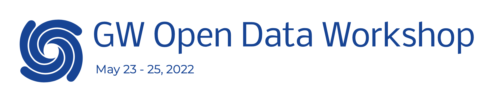

 

***
<h1 align="center">GW Open Data Workshop #5</h1>

\[fork for personal use\]

In this repository you will find the material to support [GW Open Data Workshop #5](https://www.gw-openscience.org/odw/odw2022). This forked version contains my solutions & answers to the workshop Tutorials & Challenge.

Original repo details
<blockquote>

Firstly, we recommend taking a look at the setup guide, where you can find the information to configure the workspace where you are going to execute the tutorials.

In the [Tutorials](./Tutorials/) folder, you can find the various notebooks for the three days, divided on the base of their topics. There are also some quiz that you are asked to complete at the end of each session.

Lastly, test yourself with the [GW Data Challenge](./Challenge/)!

## Software setup

At the following link, several options are presented, with the indication of their difficulty and OS dependency. Feel free to pick the one that suits best for your needs.

**[Software Setup Instructions](./setup.md)**

</blockquote>

  

## Hands-on sessions

The tutorials are divided into three folders for each one of the days of hands-on sessions. In there, you can find a summary of their topics. 

**[Tutorials](./Tutorials/)**

## Data Challenge

Here you can find a list of "challenges", ordered by difficulty, which the participants can complete, as individuals or in teams, and submit their answers. 

**[Challenge](./Challenge/)**

**[My answers](./Challenge/myans.md)**
